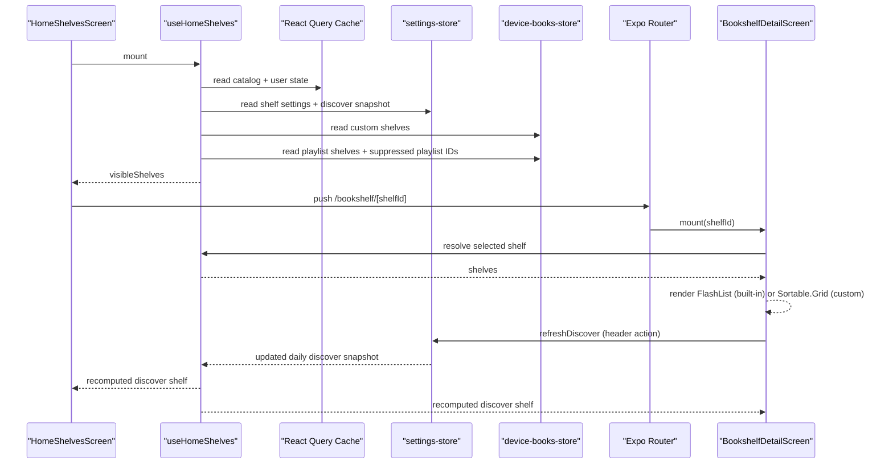

# Bookshelves: Concept, Flow, and Code Map

## Purpose
Bookshelves power the Home experience using local state with offline-first behavior:
- Built-in derived shelves: `Continue Listening`, `Recently Added`, `Discover`
- User-defined custom shelves
- Audiobookshelf-backed playlist shelves
- Shelf settings (visibility, item count, ordering)
- Daily persisted Discover selection

This document explains how data is generated, persisted, rendered, and where to change behavior.
Audience: engineering (implementation and maintenance reference).

## Core Concepts

### 1. Scope Key (multi-user, multi-library safety)
All bookshelf state is scoped by `activeLibraryUserKey + activeLibraryId`.
- Helper: `toHomeShelfScopeKey(...)`
- This prevents data leaking between users or libraries on the same device.

Primary references:
- `src/hooks/use-home-shelves.ts`
- `src/store/device-books-store.ts`
- `src/store/settings-store.ts`

### 2. Three bookshelf classes

#### Derived shelves (computed)
- `continueListening`
- `recentlyAdded`
- `discover`

Computed from React Query cache (`library books` + `user server state`) and settings.

#### Custom shelves (curated)
Stored in device Zustand store as arrays of `libraryItemId` and mapped to catalog books at render time.

#### Playlist shelves (server-backed)
Playlist shelves are app shelf projections backed by Audiobookshelf playlists. They live in the device store so the app can render and optimistically update them, but the Audiobookshelf Server is the source of truth for whether the playlist still exists.

Playlist shelves have sync state:

- `synced`: backed by a playlist currently known on the server.
- `pending`: optimistic local create/update is waiting for server confirmation.
- `unsynced`: local playlist operation still needs to sync.
- `missing`: the server no longer returns the backing playlist.

Missing playlist shelves must not be offered in Home, book Shelf Membership, or Settings/Bookshelves. Current UI filters them out instead of showing a repair state.

## Data Ownership

### React Query cache (server-owned data)
- Library catalog: `queryKeys.libraryBooks(activeLibraryId)`
- User progress/server state: `queryKeys.userServerState(activeLibraryUserKey)`

Used read-only by `useHomeShelves()` with synchronous cache access + disabled `useQuery` subscriptions.

Implementation note: those disabled subscription queries still include `meta: { persist: true }`
so they do not clear persistence metadata on shared query options.

### Device store (`device-books-store`) for custom shelves
Custom shelf CRUD lives in:
- `createCustomShelf`
- `addBookToCustomShelf`
- `removeBookFromCustomShelf`
- `renameCustomShelf`
- `deleteCustomShelf`
- `reorderCustomShelves`
- `reorderCustomShelfBooks`

Reference:
- `src/store/device-books-store.ts`

### Device store (`device-books-store`) for playlist shelves
Playlist shelf projection and optimistic mutation also live in `device-books-store`.

Primary actions:
- `createPlaylistShelf`
- `renamePlaylistShelfOptimistic`
- `addBooksToPlaylistShelfOptimistic`
- `removeBooksFromPlaylistShelfOptimistic`
- `suppressPlaylistShelf`
- `restoreSuppressedPlaylist`
- `deletePlaylistShelfFromServer`

Missing playlist shelf policy:
- Reconciliation may mark a playlist shelf `syncState: "missing"` when the server no longer returns it.
- `useHomeShelves()` filters missing playlist shelves out of the general shelf model.
- `useShelfMembershipOptions()` filters missing playlist shelves out of card menus and book detail membership management.
- The Settings editor refuses direct editing of missing playlist shelves and shows the generic missing shelf state if opened through a stale route.
- Future cleanup should remove missing playlist shelf records during playlist reconciliation once the server absence is confirmed.

### Settings store (`settings-store`) for Home presentation + Discover snapshot
- Per-shelf visibility and home item counts
- Shelf order
- Daily Discover snapshot (`dateKey`, `seed`, `bookIds`)

Reference:
- `src/store/settings-store.ts`

## Derivation Flow (`useHomeShelves`)
Main orchestrator:
- `src/hooks/use-home-shelves.ts`

Flow:
1. Read current scoped settings + custom shelves.
2. Read catalog and user server state from React Query cache.
3. Normalize progress map keyed by `libraryItemId`.
4. Build derived shelves:
   - Continue Listening: unfinished + not hidden, sorted by latest update.
   - Recently Added: catalog sorted by `addedAt` desc.
   - Discover: unread books shuffled by deterministic daily seed.
5. Merge custom shelves by mapping stored `bookIds` to catalog books.
6. Merge playlist shelves, excluding `syncState: "missing"` shelves.
7. Apply shelf ordering.
8. Expose:
   - `shelves` (full shelf arrays)
   - `visibleShelves` (Home-trimmed arrays)
   - `customShelves`
   - `playlistShelves`
   - `suppressedPlaylistShelves`
   - `refreshDiscover()`

## Sequence Diagram

## Discover Shelf Rules (current)

### Daily persistence
Discover list is daily-scoped by `YYYY-MM-DD` and persisted in settings store.
- If daily snapshot exists, use it first (then fill from unread pool if needed).
- If missing, generate from seeded shuffle and persist.

### Count cap behavior
Discover now caps to configured Discover item count (`5..25`) at generation time.
This means:
- Home Discover shows exactly N (unless unread total is lower).
- Discover detail also shows exactly that same N.
- Refresh generates a new shuffled list but still capped to N.

Code references:
- `discoverHomeItemCount` in `src/hooks/use-home-shelves.ts`
- `discover` memo and `refreshDiscover()` in `src/hooks/use-home-shelves.ts`
- `setDailyDiscoverShelf(...)` writes in `src/hooks/use-home-shelves.ts`

## Home Screen Rendering
Home screen consumes `visibleShelves` only.
- Route: `src/app/(tabs)/(home)/index.tsx`
- Screen: `src/components/Home/home-shelves-screen.tsx`
- Section row + chevron/refresh: `src/components/Home/home-shelf-section.tsx`

Behavior:
- Pull-to-refresh refetches catalog + user server state and re-derives shelves.
- If offline, Home shows a visible refresh message instead of silently failing.
- Chevron hidden for empty shelves.
- Discover row shows refresh icon.
- Clicking chevron routes to shelf detail: `/(tabs)/(home)/bookshelf/[shelfId]`
- Card menu overlays are deferred until after first interactions so the first Home Shelf Display does not pay menu setup cost.

## Shelf Membership Options

Shelf Membership options are intentionally separate from `useHomeShelves()`.

Module:
- `src/hooks/use-shelf-membership-options.ts`

This module exposes two scopes:

- `useHomeCardShelfMembershipOptions(libraryItemId)`
  - Used by Home card menus.
  - Includes only Home-visible custom shelves.
  - Includes only Home-visible, non-suppressed, non-missing playlist shelves.
  - Keeps first Home card menu behavior aligned with what users can see on Home.
- `useBookShelfManagementOptions(libraryItemId)`
  - Used by the book detail “Add To Bookshelves” sheet.
  - Includes all custom shelves.
  - Includes all non-missing playlist shelves.
  - Marks shelves hidden from Home or suppressed from app view so the sheet can show a visual indication.

Important implementation rule: do not call `useHomeShelves()` from card menu hooks. Home card menus appear per visible book, so pulling full Home shelf derivation into every menu can multiply startup work.

## Shelf Detail Rendering

### Route
- `src/app/(tabs)/(home)/bookshelf/[shelfId].tsx`

### Screen logic
- `src/components/Home/bookshelf/bookshelf-detail-screen.tsx`

Behavior split by shelf type:
- Built-in shelves: virtualized `FlashList`
  - `src/components/Home/bookshelf/bookshelf-built-in-list.tsx`
  - `src/components/Home/bookshelf/bookshelf-built-in-item.tsx`
- Custom shelves: `Sortable.Grid` with drag reorder persisted to device store
  - `src/components/Home/bookshelf/bookshelf-grid-item.tsx`

Additional behavior:
- Native transparent stack header (`Stack.Screen` options in screen)
- Discover-only refresh action in header right
- Lightweight loading state shown immediately on route open

## Settings Flow

### Settings routes
- `src/app/(tabs)/settings/bookshelves.tsx`
- `src/app/(tabs)/settings/bookshelf-editor.tsx`

### Settings screens/components
- List + reorder + create entrypoint:
  - `src/components/settings/bookshelves/bookshelves-screen.tsx`
- Editor sheet for visibility/count/name/delete:
  - `src/components/settings/bookshelves/bookshelf-editor-sheet.tsx`
- Supporting components:
  - `src/components/settings/bookshelves/bookshelf-list-item.tsx`
  - `src/components/settings/bookshelves/count-stepper.tsx`

Behavior:
- Settings lists all derived shelves, custom shelves, and non-missing playlist shelves for the Active Library.
- Suppressed playlist shelves appear under “Hidden from app” and can be restored.
- Missing playlist shelves do not appear in the main list or the hidden list.
- Reordering persists visible/non-suppressed order, while preserving suppressed playlist IDs at the end of stored order.
- Creating a Playlist Shelf creates an Audiobookshelf playlist when Done is pressed.

## Key Design Decisions
1. Offline-first local bookshelf derivation from cache/state (no personalized endpoint dependency).
2. Hard scope isolation by `userKey + libraryId`.
3. Discover is deterministic per day + refreshable, now capped to user-configured size.
4. Built-in detail uses virtualized list for large libraries; custom detail keeps sortable drag UX.
5. Home routes stay thin; logic in reusable components/hooks.
6. The server is authoritative for playlist shelf existence; missing playlist shelves are hidden from all management surfaces.
7. Shelf Membership option derivation stays separate from Home shelf derivation to keep startup display fast.

## Where to Change Things
- Change shelf composition rules: `src/hooks/use-home-shelves.ts`
- Change custom shelf persistence/actions: `src/store/device-books-store.ts`
- Change item count bounds / settings model: `src/store/settings-store.ts`
- Change Home row UX: `src/components/Home/home-shelf-section.tsx`
- Change detail list layout/perf: `src/components/Home/bookshelf/*`
- Change settings UX for shelf editing: `src/components/settings/bookshelves/*`
- Change book-level Shelf Membership rules: `src/hooks/use-shelf-membership-options.ts`

## Known Constraints
- Built-in shelf details currently show full derived arrays except Discover (which is now capped at source).
- Custom shelf size is assumed manageable for sortable grid in current version.
- Discover snapshot is day-based, not time-window-based.
- Missing playlist shelf records may still exist in local state until reconciliation cleanup removes them, but user-facing surfaces should not expose them.

## Suggested Next Enhancements
1. Add explicit per-shelf “detail max items” policy if needed for Continue/Recently Added.
2. Add telemetry around shelf open time and list render time.
3. Add tests around Discover day rollover + count changes.
4. Add user-facing “last refreshed” timestamp for Discover.
5. Delete confirmed missing playlist shelf records during playlist reconciliation.
