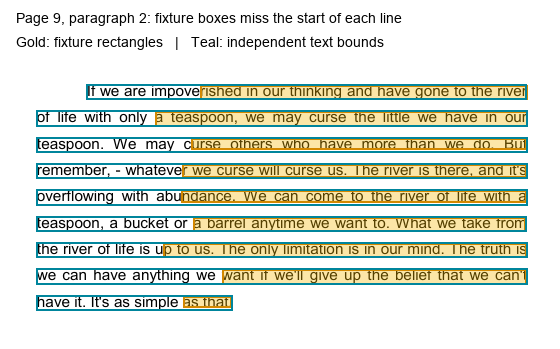
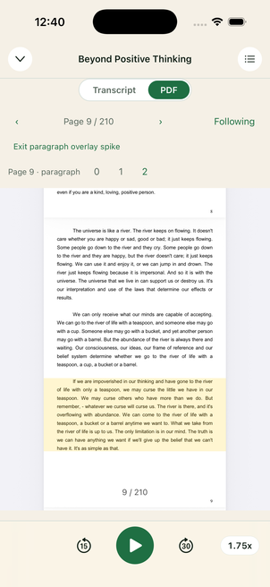

# PDF paragraph overlay spike

Prove that a single translucent paragraph bounding box follows the Readium PDF view. The user changed the rendering requirement on 2026-10-01: highlight the whole paragraph block, including interline gaps, and allow the box to begin at the PDF's visible left margin. This replaces the original per-line highlighting requirement. The separate paragraph file supplies vertical bounds; the page map format does not change.

## What you have

Two fixtures, side by side:

- `src/pdf/__fixtures__/beyond-positive-thinking.pdf-pages.json` — leave this file alone. Page follow already uses it.
- `src/pdf/__fixtures__/beyond-positive-thinking.pdf-paragraphs.json` — new. 1,167 paragraphs, 210 pages. Kind `pdf-paragraph-alignment`.

Both name the same PDF:

- sha256 `cf7ecf22c01d9b868e73bcd4324d5fc76ff7cd22cd7b5b4e074a8b6192d38dbb`
- pageCount 210

Load that PDF. If the hash or the page count disagrees, stop. Do not draw.

## What a paragraph record is

`rectSpace` is `origin: bottom-left`, `box: cropBox`, `unit: millipoint` (1/1000 of a PDF point).

Each paragraph:

| Key | Meaning |
| --- | --- |
| `p` | 0-based PDF page index. Readium's `#page=` locator is `p + 1`. |
| `i` | Order of the paragraph on that page, top to bottom. |
| `prov` | `m` matched, `i` interpolated, `u` unaligned. |
| `c` | Match fraction. Present for `m` and `i`. `i` is `0`. |
| `startMs`, `endMs` | Book Time, integer milliseconds. Omitted when `prov` is `u`. |
| `trackIndex`, `trackStartMs`, `trackEndMs` | Same timing shape as a page, so a later rebase can reuse the page-map path. This book has one track, so track time equals book time. |
| `rects` | `[x, y, width, height]` in millipoints. One box per visual line. |

There is no paragraph text. The PDF already has the words. Do not invent a text field.

`prov: u` has rects and no times. Do not highlight it from the clock. Pages 0–1 of this book are front matter and are unaligned; page 8 is not.

The format is provisional until this spike says the boxes land on the ink. Do not bump `pdf-pages.json` `formatVersion`.

## The page to draw

Page `p = 8` (locator `#page=9`). Three matched paragraphs, all `prov: m`. Stay on this page for the whole spike.

| `i` | Book Time | Line boxes | Where the first box sits (points) |
| --- | --- | --- | --- |
| 0 | 568620–608040 | 8 | x=165.9 y=684.4 w=316.5 h=10.4 |
| 1 | 608040–637740 | 7 | x=165.7 y=494.7 w=315.7 h=10.4 |
| 2 | 638040–677460 | 9 | x=247.2 y=342.9 w=235.3 h=10.2 |

Paragraph `i = 2` is the one to judge. Its box spans the visible PDF width, covering the indentation and the short last line. Horizontal line-box errors no longer affect coverage.

## How to turn a rect into view coordinates

```swift
let page = document.page(at: paragraph.p)!
// First convert the source line rectangles from millipoints to PDF points.
let cropBox = page.bounds(for: .cropBox)
let bottom = lineRects.map(\.minY).min()!
let top = lineRects.map(\.maxY).max()!
let rect = CGRect(
    x: cropBox.minX,
    y: bottom - 3,
    width: cropBox.width,
    height: top - bottom + 6
).intersection(cropBox)
let viewRect = pdfView.convert(rect, from: page)
```

`pdfView` is the `PDFDocumentView` inside Readium's PDF navigator. The navigator does not conform to `DecorableNavigator`, so the EPUB decoration path will not show these boxes. Draw them yourself on an overlay, or with `PDFPageOverlayViewProvider` (iOS 16+).

Convert once when the page is shown or when zoom changes. Do not convert on a playback frame.

## Pass

1. Open the PDF on `#page=9`.
2. Draw one translucent rectangle for paragraph `i = 2`, from the crop box's left margin to its right margin. Its vertical extent covers the first through last line, with 3 PDF points of padding above and below, clipped to the crop box. It includes the gaps between lines and does not cover the paragraph above.
3. Step the highlight from `i = 0` to `i = 1` to `i = 2` without changing `p`. The page does not turn. Each step replaces the previous paragraph box.
4. Write down the transform that worked: crop box, page rotation, and whether `pdfView.convert(_:from:)` was sufficient or an extra flip was required. A miss of more than about half a line height (~5 pt) means the origin or the box is wrong.

## Do not change

- Page follow, the go-back toast, or swipe behavior. A swipe still browses and does not seek. This spike does not wire tap-to-seek.
- `beyond-positive-thinking.pdf-pages.json`.
- The rule that a missing or bad paragraph file leaves page follow working. Parse the paragraph file on its own. If it fails, draw nothing.

Playback wiring was out of scope for the original geometry spike. For the subsequent audio-driven step, paragraph `i = 2` is book time 638040–677460 ms, and the next wake is the next paragraph boundary, not a per-frame tick. Turn the page only when `p` changes.

## Known limit, not a spike bug

On this page the word "results." is the last word of the river paragraph, and the PDF leaves a large gap in front of that short line. The file attaches it to paragraph `i = 1`. Judge `i = 2`, and judge the body of `i = 0`. Do not retune the page map to compensate.

## Earlier per-line spike result - 2026-10-01

**Per-line geometry acceptance failed for the supplied paragraph fixture.** The native overlay rendered and followed PDFKit scrolling/zooming, but the source line rectangles left substantial ink uncovered. This is distinct from the known `results.` grouping issue. The subsequent requirement change to a margin-wide paragraph box removes the dependency on those inaccurate horizontal bounds; the evidence below is retained to explain that decision.

Implemented:

- An independent provisional paragraph parser; missing, malformed, wrong-hash or wrong-page-count sidecars draw nothing and leave page follow available.
- A page-owned `PDFPageOverlayViewProvider`, installed in Readium's `setupPDFView` callback before the document is attached. It now paints one translucent yellow paragraph box at 18% opacity, with touches disabled, creates no PDF annotations, and never navigates or seeks.
- The existing Nitro decoration payload transports one paragraph in a private `laabs-pdf-paragraph` group. `HybridReadiumView` routes this directly to the PDF overlay before the EPUB `DecorableNavigator` path. Replacing/clearing that group removes the previous paragraph's boxes.
- Development builds expose **Test paragraph highlights** only after the opened PDF's verified hash and actual page count match the fixture. It opens `#page=9` with paragraph `2` selected. Buttons `0`, `1`, `2` replace the boxes without turning the page or changing audio. Audio-driven page navigation is suspended while the explicit spike is open; **Exit paragraph overlay spike** removes its boxes and restores normal follow behavior.

Transform checked on the cached PDF whose independently computed SHA-256 matches the fixture:

- Physical page `p=8`, actual document page count `210`.
- Media box: `(0, 0, 612, 792)` points.
- Crop box: `(99.36, 63.36, 413.28, 656.64)` points (origin and size).
- Page rotation: `0` degrees.
- Divide each input coordinate by `1000`, call `pdfView.convert(rect, from: page)`, then convert that view rectangle into the page-owned overlay. PDFKit accounts for the nonzero crop origin and Y direction; **no extra flip or crop-origin translation** was needed. Layout updates rebuild the layer path; PDFKit carries the overlay through scrolling and zoom, with no playback-frame conversions.

The vertical alignment of paragraph `2` lands on its own nine lines, without covering the paragraph above. The earlier per-line rendering failed horizontal coverage:

| Line of paragraph 2 | Fixture x / width (pt) | Independent text x / width (pt) | Miss at left edge |
| --- | --- | --- | --- |
| First | 247.216 / 235.294 | 165.600 / 316.760 | 81.616 pt |
| Last | 234.879 / 34.707 | 129.600 / 140.948 | 105.279 pt |

An independent Poppler page render and pdfplumber text bounds agree with the visible ink. A separate PDFKit `characterBounds(at:)` probe reproduces the fixture's narrowed rectangles; those character bounds are unreliable for this PDF. The left-edge miss varies between lines, while paragraph `0`'s first line is already close to correct, so a constant translation or Y flip cannot repair the file. The producer should check its geometry extraction against rendered ink and retain complete visual-line extents, including the indented first line and short final line. The paragraph fixture and page map were preserved for reproduction.



Validation: iPhone 17 Pro simulator, iOS 26.5; native development build succeeded with zero errors/warnings. Stepped `0 -> 1 -> 2` on page 9, confirmed replacement and alignment persistence after pinch zoom. All 67 focused PDF/seek tests passed; TypeScript and lint checks passed. The package patch applies to a clean `react-native-readium@5.1.1` archive and is accepted by patch-package's parser.

Next: verify the margin-wide paragraph rendering, then add paragraph-boundary audio scheduling and track-time rebasing. Accurate vertical bounds and paragraph membership still matter; the known `results.` grouping issue remains. Page turns remain governed by the existing physical-page map.

## Single-box spike result - 2026-10-01

**The revised paragraph-2 visual check passes.** One translucent rectangle covers all nine lines from the visible PDF's left margin to its right margin, including the indentation, short final line and gaps between lines. It uses the minimum line Y and maximum line Y-plus-height, with 3 PDF points of vertical padding, clipped to the crop box. The native renderer ignores individual line X coordinates and widths, so the earlier horizontal extraction errors no longer block this design.

On the iPhone 17 Pro simulator, switched `0 -> 1 -> 2` on page 9: each box replaced the previous one, the page stayed put and audio stayed paused. Pinch zoom preserved coverage. The known `results.` paragraph-membership issue remains visible and does not affect paragraph 2. The native build succeeded; its warnings concern existing audio/transcription code. All 67 focused PDF/seek tests and the changed test's lint check passed. The updated native patch applies to the clean package source.



Next: use paragraph time boundaries to select this single box during playback, including seeks, pauses, playback-rate changes and current-track rebasing. Keep page navigation on the existing physical-page map. This geometry-only stage is now followed by the audio-driven implementation below.


## Audio-driven paragraph selection - 2026-10-01

Implemented automatic selection using the existing playback clock. Paragraph starts and ends are half-open intervals; one rate-adjusted timer targets the next start/end and player ticks re-anchor it. The overlay changes only with paragraph identity. Pausing retains the selected box; seeks and playback-rate changes select the current interval. Untimed paragraphs, gaps, and audio beyond the last interval clear the box. Backgrounding, focus loss, another playing book and suspended Follow Mode remove the paragraph timer.

Page navigation remains on the physical-page map. Paragraph changes on the same page replace the box without turning pages or seeking. Manual browsing clears highlighting; Resume following returns to the narrated page and restores the live paragraph. A displayed-page/narrated-page guard avoids showing a box on the wrong page while navigation settles.

The sidecar is parsed and loaded independently, must match the source page-map alignment ID and PDF hash/count, and inherits that map's track manifest. Matching tracks preserve Book Time; changed tracks rebase Track Time using current rolling offsets. Ambiguous/missing tracks and overlapping schedules draw nothing while page follow remains available. Optional server sidecars use `laabs.*.pdf-paragraphs.json`, cache original JSON separately, and permit validated offline reuse. The fixture remains a development-only fallback for this document when no server sidecar is declared.


Validation: 342 tests passed across 31 PDF, Read-Along, EPUB/alignment and seek suites; TypeScript, focused ESLint and formatting checks passed. On iPhone 17 Pro / iOS 26.5, actual playback at 1.75× selected `8:0 -> 8:1 -> 8:2` on physical page 9, then followed onto page 10. Pausing retained the box; paused seeks selected the right interval. Next-page browsing cleared the overlay without moving audio; Resume following returned to page 9 and restored `8:2` at the same Listening Position. The original paused position was restored after verification. The native overlay from the preceding spike was reused, so this step required no native rebuild.

The live check also exposed stale playback anchors on pause/resume before another engine tick. Both PDF clock hooks now re-anchor state transitions and seeks immediately, and speed changes preserve the current interpolated position before adopting the new rate. Regression tests cover these transitions without requiring a fresh tick timestamp.


The sample was checked using the development fallback; server sidecar download/offline/error paths are covered by automated tests, with a real offline reopen still unmeasured. The known `results.` grouping error remains in the producer fixture.
