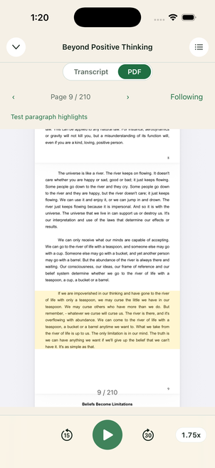

# PDF Read-Along

PDF Read-Along is available on iOS when an Audiobookshelf item contains a PDF paired with `laabs.*.pdf-pages.json`. Open **Read Along** from the player, then select **PDF**. The selector offers only the available Transcript, EPUB, and PDF surfaces. Existing `surface=book` links still select EPUB. If several PDFs have maps, the PDF surface offers a document chooser.

The producer authority is `/Users/markmccoid/Documents/myProgramming/MacOS/LAABS Audio Align/docs/contracts/pdf-page-alignment.md`. This implementation consumes version 1, kind `pdf-page-alignment`. It does no extraction or word highlighting. An optional version 1 `pdf-paragraph-alignment` sidecar adds paragraph highlighting using the same audio clock.

## Behavior

- Follow Mode starts on. Playback shows the last timed physical page whose start is at or before Listening Position, including interpolated pages. Before the first timed page the reader stays where it is; gaps and the end of the audio retain the preceding timed page.
- Scrolling, swiping, and previous/next browse without seeking audio and suspend Follow Mode. A floating **Resume following** button returns to the page currently being narrated without changing Listening Position. Touching the reader clears pending automatic navigation so a user swipe takes priority.
- While browsing, **Listen from page N** explicitly seeks to that timed page's start and resumes following. Untimed pages have no Listen action. Seeking preserves paused/playing state.
- PDF page seeks and EPUB text taps show a 10-second **Go back** toast. It restores the Listening Position captured immediately before the seek (interpolated when playing) and resumes following. The newest seek replaces the prior undo. Failed seeks and cancellations before audio moves offer no undo; a superseded native checkpoint after a confirmed jump still offers recovery, and expired, unmounted, or changed-playback actions cannot move another book's audio.
- The Follow toggle can also suspend following or return to Listening Position.
- Actual PDF bytes are hashed natively with SHA-256. Readium supplies page count from its PDF parser. A hash/count mismatch, degraded map, zero matched pages, or incompatible audio tracks disables both following and page-to-audio seeking. The PDF remains readable and offers **Reload PDF and page map**.
- With a valid `laabs.*.pdf-paragraphs.json` sidecar, Follow Mode selects one translucent yellow box spanning the PDF crop-box margins and the active paragraph’s vertical bounds. Paragraph intervals include matched and interpolated records; unaligned records, timing gaps, and positions outside narration have no highlight. Pausing retains the current paragraph, and seeks or speed changes resolve against the current Listening Position. Browsing/Follow off clears the box; Resume following restores it. Paragraph changes never turn pages or seek audio.
- A missing, malformed, degraded, mismatched, or incompatible paragraph sidecar draws nothing and leaves page following available. The sidecar must reference the loaded page map’s alignment ID and the opened PDF’s hash/count.
- The native reader uses single-page continuous vertical scrolling, fit to width, and pinch zoom. PDF hides text appearance controls.

## Modules and storage

| Module | Responsibility |
| --- | --- |
| `src/pdf/pdf-page-files.ts` | Enumerate and pair PDF/map files using tolerant stems; refuse ambiguous pairings. |
| `src/pdf/pdf-page-artifact.ts` | Validate and normalize the producer contract, retaining every physical page. |
| `src/pdf/pdf-page-sync.ts` | Preserve or rebase timing against ordered audio tracks, binary-search pages, convert Readium locators, validate document identity. |
| `src/pdf/pdf-asset.ts` | Download a durable PDF atomically, coalesce concurrent requests, hash bytes outside the JS heap. |
| `src/data/sqlite/shadow-db-pdf-pages.ts` | Persist original small schedules in schema v10's `pdf_page_maps`, separate from EPUB maps. |
| `src/pdf/use-pdf-page-sources.ts` | Combine server discovery with cached document availability. |
| `src/pdf/use-pdf-playback-page.ts` | Subscribe to playback and schedule only the next page boundary. |
| `src/pdf/pdf-paragraph-artifact.ts` | Validate the optional paragraph contract and transport one paragraph through the PDF-only decoration group. |
| `src/pdf/pdf-paragraph-sync.ts` | Rebase paragraph Track Time and resolve half-open intervals, clearing gaps. |
| `src/pdf/use-pdf-playback-paragraph.ts` | Maintain one timer for the next paragraph start/end; re-anchor on playback updates. |
| `src/pdf/pdf-paragraph-loader.ts` | Load optional sidecars independently; validate identity and use cached JSON offline. |
| `src/data/sqlite/shadow-db-pdf-paragraphs.ts` | Store original paragraph JSON by book/PDF and source page-map alignment ID. |
| `src/pdf/pdf-page-navigation.ts` | Classify initial, navigator-issued, and reader-issued location callbacks. |
| `src/components/read-along/pdf-read-along-surface.tsx` | Load the selected map/PDF, offer retry, rebase audio timing, isolate document switches. |
| `src/components/read-along/pdf-read-along-view.tsx` | Bind Readium callbacks, page controls, suspended Follow Mode, and explicit page seeks. |

Assets live in `Paths.document/laabs-pdfs`, keyed by audiobook, PDF ino, and expected SHA-256. Failed downloads never become final files. Cached contract JSON is used when a map cannot be fetched; cached PDF bytes are still hashed on reopen. If current audio metadata is unavailable, the PDF remains readable while synchronization is disabled. Reload explicitly replaces the cached PDF and map.

Ordered filenames/durations compare the same inputs as the producer's track fingerprint. Matching tracks retain producer Book Time, including cross-track ends. Changed tracks rebase from Track Time using current offsets; missing/ambiguous tracks or reversed page order fail closed. The producer's documented cross-track rebasing limitations still apply.

The playback hook keeps only page identity in React state and uses one boundary timer, re-anchored by existing player ticks and rate changes. It performs no animation-frame sampling. Focus loss, backgrounding, pausing, or a different playing book removes the timer. While following is suspended, the current narrated page is still resolved so Resume following returns to live audio. Transcript word sampling is disabled while a document surface is visible. Navigation is issued only when the target differs from the displayed/pending page; location acknowledgements never create audio feedback.

Published `react-native-readium@5.1.1` includes the PDF reader/module used here. Its installed PDF sources and module registration were compared with the npm tarball; page following required no new dependency. The package patch now additionally installs a PDFKit page overlay provider and routes the private paragraph decoration group directly to PDF. One crop-box-wide rectangle at 18% opacity encloses the supplied lines with 3 PDF points of vertical padding. PDFKit converts and lays out the overlay on page layout/zoom changes. Existing EPUB tap patches remain in place.

## Validation

The checked-in Beyond Positive Thinking map fixture contains 210 physical pages: 201 matched, 7 interpolated, 2 unaligned; the original shipped JSON is 29,964 bytes. The accompanying 764,127-byte PDF's SHA-256 matches the map. The PDF itself is not checked in.

Automated coverage checks the real map, malformed inputs, pairing ambiguity, exact boundaries and gaps, interpolation, stale track offsets, document mismatches/degraded maps, reader/navigation feedback, paused seeks, timer lifecycle, native hashing/cache reuse, concurrent loading, and partial-download cleanup. The existing EPUB/alignment and Read-Along suites are included in regression verification.

Verification on 2026-10-01: 313 tests passed in 25 suites; TypeScript and focused ESLint passed. The current iOS development app built with zero errors. On iPhone 17 Pro / iOS 26.5, the actual sample passed open/page-count validation, paused next/previous and scroll seeks, Follow-off browsing/Follow-on return, playback-driven page changes at 1.75×, pinch zoom, and Transcript/PDF switching and reopening. A real network-disconnected reopen and battery-duration profile remain unmeasured; automated tests cover asset reuse and timer shutdown.

UX refinement verification on 2026-10-01: 307 tests passed in 26 suites; TypeScript and focused lint for new code passed. Live iOS checks confirmed browse-without-seek, Resume following back to live audio, explicit Listen from page, and Go back to the exact pre-seek position while paused. Existing EPUB effect lint issues are unchanged; EPUB recovery was covered by a component integration test.

## Paragraph playback - 2026-10-01

Paragraph sidecars load after the PDF is ready and cannot delay or fail PDF opening. A separate additive `pdf_paragraph_maps` table caches source JSON, never authentication tokens or rebased times. Network failures can reuse a valid cached sidecar; refresh requires a fresh download. A removed (404/410) or invalid downloaded sidecar discards its old cache. Matching ordered tracks retain original Book Time; changed tracks use rolling offsets and Track Time from the referenced page map. Missing/ambiguous tracks or overlapping/reversed paragraph schedules disable the overlay alone. The page map remains responsible for all navigation.

The paragraph hook uses the existing interpolated playback clock and one start/end boundary timer, independent of the page timer. Player updates, pause/resume, rate changes, explicit seeks, foregrounding and focus changes re-anchor selection. Backgrounding, focus loss, another book, Follow off and manual geometry testing remove the paragraph timer. The view only sends a paragraph when its page agrees with both the displayed and narrated page, so a pending page turn cannot highlight another page.

Development builds can use the checked-in Beyond Positive Thinking paragraph fixture when no server paragraph sidecar is declared; it still requires the matching source page-map ID and verified PDF hash/count. Release builds require a discovered or cached sidecar. The explicit **Test paragraph highlights** controls remain for independent geometry checks. The known `results.` paragraph-membership error in this fixture remains a producer-data issue.

Validation: 342 tests passed across 31 PDF, Read-Along, EPUB/alignment and seek suites; TypeScript, focused ESLint and formatting checks passed. On iPhone 17 Pro / iOS 26.5, actual playback at 1.75× selected `8:0 -> 8:1 -> 8:2` on physical page 9, then followed onto page 10. Pausing retained the box; paused seeks selected the right interval. Next-page browsing cleared the overlay without moving audio; Resume following returned to page 9 and restored `8:2` at the same Listening Position. The original paused position was restored after verification. The native overlay from the preceding spike was reused, so this step required no native rebuild.

The live check also exposed stale playback anchors on pause/resume before another engine tick. Both PDF clock hooks now re-anchor state transitions and seeks immediately, and speed changes preserve the current interpolated position before adopting the new rate. Regression tests cover these transitions without requiring a fresh tick timestamp.

The sample was checked using the development fallback; server sidecar download/offline/error paths are covered by automated tests, with a real offline reopen still unmeasured. The known `results.` grouping error remains in the producer fixture.
