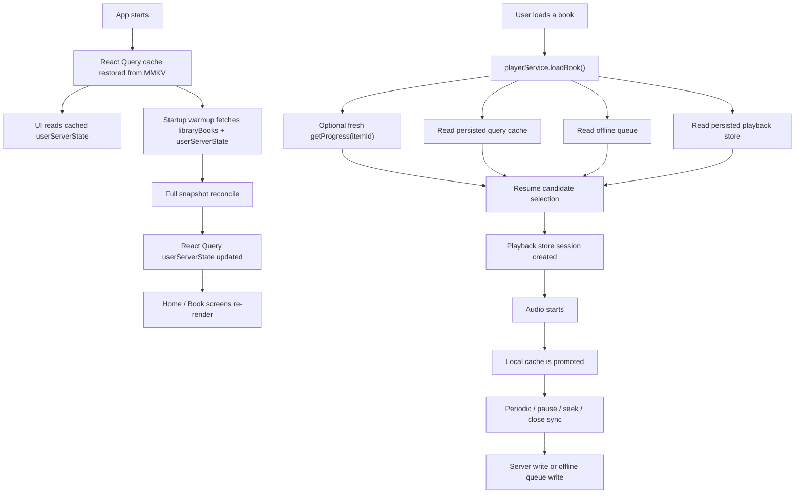

# Progress Cache Lifecycle

This document explains how book progress moves through the app from startup to playback to offline queue sync.

The goal is to make a junior developer comfortable tracing:

- where progress is stored
- when it is restored
- when the app pulls fresh progress from the server
- how the app chooses a resume point when a book loads
- how progress is kept up to date while the user listens
- why some screens can temporarily disagree

This is the best document to read if you need to debug progress restoration, disappearing progress UI, or server/cache disagreements.

## System Overview

## Read This First

There is not one single "progress store" in this app.

Progress can exist in four different places:

1. `React Query persisted cache`
   File locations:
   - `src/store/mmkv-query-persister.ts`
   - `src/query/query-client.ts`
   - `src/hooks/abs-data-hooks.ts`
   - `src/api/me-api.ts`

2. `Playback store`
   File location:
   - `src/player/playback-store.ts`

3. `Offline pending queue`
   File location:
   - `src/store/device-books-store.ts`

4. `Audiobookshelf server`
   File locations:
   - `src/api/me-api.ts`
   - `src/api/items-api.ts`
   - `src/api/playback-api.ts`
   - `src/api/sessions-api.ts`

These four places do not all serve the same purpose:

- The React Query cache is the main persisted app-wide progress view.
- The playback store is the active player session plus a small persisted fallback.
- The offline queue is for unsent progress when the app cannot sync immediately.
- The server is the remote source of truth, but we do not trust every server response blindly.

## Key Concepts

### `UserServerState`

The app’s main progress snapshot is `UserServerState` in `src/api/me-api.ts`.

It contains:

- `progressByLibraryItemId`
- `bookmarksByLibraryItemId`
- `favoriteByLibraryItemId`
- `favoritesLibraryId`

`progressByLibraryItemId` is what most UI screens use to answer:

- Has this book been started?
- Where should the progress bar be?
- Should this book appear in Continue Listening?
- Should the Home "time listened / time left" pill render?

### Full snapshot vs targeted progress pull

There are two different server read styles:

1. `Full snapshot`
   File location:
   - `src/api/me-api.ts`

   Method:
   - `meApi.getUserServerState()`

   This rebuilds a full `UserServerState` object from `/api/me` plus favorites.

2. `Single-book progress pull`
   File location:
   - `src/api/me-api.ts`

   Method:
   - `meApi.getProgress(libraryItemId)`

   This fetches only one book’s progress from `/api/me/progress/:itemId`.

This distinction matters:

- full snapshots update the whole cached `userServerState`
- single-book pulls upsert one book into that cache

## The Storage Layers

### 1. React Query persisted cache

Files:

- `src/store/mmkv-query-persister.ts`
- `src/query/query-client.ts`
- `src/app/_layout.tsx`
- `src/query/query-keys.ts`

What it does:

- Persists selected React Query data into MMKV
- Restores that data on app startup
- Keeps the cache around forever unless explicitly cleared

Important details:

- `src/store/mmkv-query-persister.ts`
  - creates a dedicated MMKV instance with id `laabs-mmkv-query`
  - stores the dehydrated React Query snapshot under `react-query-cache`

- `src/query/query-client.ts`
  - sets `staleTime` to 5 minutes
  - sets `gcTime` to `Infinity`
  - disables retries by default

- `src/app/_layout.tsx`
  - wraps the app in `PersistQueryClientProvider`
  - configures persistence so only queries with `meta.persist === true` are saved

- `src/query/query-keys.ts`
  - defines `queryKeys.userServerState(userKey)`
  - this key is the central cache location for progress used across the app

Meaning:

- when the app opens, previously persisted `userServerState` is available before any new network request finishes
- this is why the UI can show progress immediately on launch

### 2. Playback store

File:

- `src/player/playback-store.ts`

What it does:

- holds the active player session state
- persists a small subset of that state to MMKV

Persisted subset:

- `libraryItemId`
- `bookTitle`
- `currentTrackIndex`
- `positionMs`
- `rate`

Important limitation:

- this is not the main long-term progress store for the whole app
- it is primarily a player continuity fallback
- normal session transitions often clear or overwrite this state

Why it still matters:

- `playerService.loadBook()` can use it as a resume candidate
- if React Query cache is stale or missing, the playback store can still help restore the user’s place

### 3. Offline pending queue

File:

- `src/store/device-books-store.ts`

What it does:

- stores progress that could not be synced to the server immediately
- persists that queue in Zustand/MMKV
- flushes queued entries back to the server when the app is online again

Key state:

- `pendingProgressByUser`

Key methods:

- `queueProgressSync(...)`
- `clearPendingProgressSync(...)`
- `hasPendingProgressSync(...)`
- `syncPendingProgress(...)`

Why it matters:

- the queue is a real progress source during resume selection
- a user can have a newer queued local position than the persisted query cache or the server

### 4. Audiobookshelf server

Files:

- `src/api/me-api.ts`
- `src/api/items-api.ts`
- `src/api/playback-api.ts`
- `src/api/sessions-api.ts`

Server endpoints used for progress:

- `GET /api/me`
  - used by `meApi.getUserServerState()`
- `GET /api/me/progress/:itemId`
  - used by `meApi.getProgress(itemId)`
- `PATCH /api/me/progress/:itemId`
  - used by `meApi.updateProgress(itemId, payload)`
- session APIs
  - used for streamed playback sync via `sessionsApi.syncSession(...)`

## Startup Lifecycle

This section explains what happens from cold app launch until the user sees progress in the UI.

### Step 1: React Query cache is restored from MMKV

File:

- `src/app/_layout.tsx`

Relevant pieces:

- `PersistQueryClientProvider`
- `persistOptions`
- `handleQueryRestoreSuccess`
- `handleQueryRestoreError`

What happens:

1. The provider asks `mmkvQueryPersister` for the saved cache snapshot.
2. Only queries that opted into persistence are restored.
3. `userServerState` is one of those persisted queries.

Result:

- screens can synchronously read cached progress before any fresh network request completes

### Step 2: startup warmup runs in the background

File:

- `src/app/_layout.tsx`

What happens:

After restore, startup warmup schedules background prefetches for:

- `libraryBooks`
- `userServerState`

Important behavior:

- warmup is asynchronous
- it does not block the user from opening a book
- the app can render from persisted cache first, then later update from the server

This is one reason progress bugs can feel racey:

- first render can use persisted cache
- then a background refresh can replace or reconcile that cache

## How `userServerState` is Built

File:

- `src/api/me-api.ts`

Method:

- `meApi.getUserServerState()`

What it does:

1. Reads the active library id from auth state if needed.
2. Calls:
   - `meApi.getMe()`
   - `libraryItemsApi.getFavorites(...)`
3. Filters `userData.mediaProgress` down to progress owned by the current user.
4. Converts each raw server progress entry into `UserBookProgress`.
5. Inserts that progress into `progressByLibraryItemId`.

Important implementation detail:

The code writes progress under both:

- `progress.libraryItemId`
- `progress.mediaItemId`

This is done by `upsertProgress(...)` in `src/api/me-api.ts`.

Why:

- some parts of the app still encounter progress keyed by media ids
- later code normalizes back to `libraryItemId`

Normalization helper:

- `normalizeUserProgressByLibraryItemId(...)` in `src/api/me-api.ts`

This helper is used in multiple consumers to collapse any mixed key shapes into one map indexed by `libraryItemId`.

## Why Full Snapshot Refreshes Need Reconciliation

File:

- `src/query/user-server-state-reconcile.ts`

This file exists because a raw server snapshot is not always safe to apply by simple replacement.

Before this reconciler existed, a full `userServerState` refresh could:

- remove an entry that still had local evidence
- cause Home UI to lose progress temporarily
- disagree with the player’s own resume logic

### What the reconciler does

Main exports:

- `reconcileUserServerState(previousState, incomingState, context)`
- `fetchReconciledUserServerState(queryClient, activeLibraryUserKey)`

How it works:

1. Read the previous cached `userServerState`.
2. Fetch a fresh incoming snapshot from the server.
3. Compare progress entry-by-entry instead of replacing the whole map blindly.
4. For each book, choose the preferred progress record.

### Progress selection rules inside the reconciler

The helper `pickPreferredProgress(...)` chooses between previous and incoming progress.

The current rules are:

1. If only one side exists, use that side.
2. If the incoming entry is newer by `lastUpdate`, use incoming.
3. If the previous entry is newer by `lastUpdate`, keep previous.
4. If `lastUpdate` ties, prefer the entry with larger `currentTime`.
5. If time also ties, prefer the entry that marks the book finished.
6. If needed, prefer the entry that hides the book from Continue Listening.

### Preserving missing progress

The reconciler also answers:

"If the incoming full snapshot does not include a book that exists in the previous cache, should we keep the old entry for now?"

Current answer:

Yes, but only when there is local evidence that the old progress is still meaningful.

That logic lives in `shouldPreserveMissingProgress(...)`.

The current preserve rules are:

- keep it if there is queued progress for that book
- keep it if the active playback store is on that book and position is greater than zero
- keep it if the previous entry is recent enough

Current time window:

- `15 minutes`

Why this matters:

- it protects UI from losing progress instantly during a full snapshot refresh
- it avoids keeping stale ghost progress forever

## Where Full Snapshot Reconcile Is Used

The app now routes full `userServerState` pulls through `fetchReconciledUserServerState(...)`.

### 1. Main progress query hook

File:

- `src/hooks/abs-data-hooks.ts`

Hook:

- `useGetUserServerState()`

What it does:

- reads the authenticated `activeLibraryUserKey`
- calls React Query with `queryKeys.userServerState(activeLibraryUserKey)`
- uses `fetchReconciledUserServerState(...)` as the query function

Meaning:

- any screen using `useGetUserServerState()` gets the reconciled version, not a raw full replacement

### 2. Startup warmup

File:

- `src/app/_layout.tsx`

What it does:

- background prefetches `userServerState`
- now uses `fetchReconciledUserServerState(...)`

### 3. Offline reconnect retry

File:

- `src/components/offline-connection-banner.tsx`

What it does:

- when the user taps Retry after reconnecting
- fetches libraries, books, and `userServerState`
- the `userServerState` fetch now goes through the reconciler

### 4. Player-side cache fetch when needed

File:

- `src/player/player-service.ts`

Method:

- `getCachedUserServerState(...)`

What it does:

- returns the current cached `userServerState`
- can fetch it if missing
- if it fetches, it uses the reconciled fetch helper

## Single-Book Progress Pulls

Single-book pulls do not use the full snapshot reconciler because they are not replacing the entire world.

### Book detail reconcile

File:

- `src/hooks/abs-data-hooks.ts`

Hook:

- `useReconcileBookProgress(libraryItemId)`

What it does:

1. Calls `meApi.getProgress(libraryItemId)`.
2. Reads the previous cached entry for that one book.
3. Refuses to regress if previous cache has a newer `lastUpdate`.
4. Upserts the single book into `userServerState`.

Where it is used:

- `src/components/bookComponents/BookContainer.tsx`

This is why the book detail screen often has fresher progress than other screens.

### Load-time fresh server progress pull

File:

- `src/player/player-service.ts`

Methods:

- `startFreshServerProgressFetch(...)`
- `awaitFreshServerProgressForLoad(...)`
- `applyServerProgressSnapshotToCache(...)`

What it does:

When a book loads, the player:

1. starts `meApi.getProgress(libraryItemId)` immediately if online and authenticated
2. waits up to a short timeout before choosing the resume point
3. if the response arrives in time and does not look stale, it is written into cache and used as a resume candidate
4. if it times out, the player continues using local candidates and the request can still finish later

Current timeout:

- `350ms`

Why:

- keeps downloaded books from feeling sluggish
- still gives the app a chance to use fresh server progress when available

### Server regression protection during load

The player does not trust every `getProgress()` response blindly.

In `applyServerProgressSnapshotToCache(...)`, the player checks:

- cached current time
- server current time
- cached last update
- server last update

If the incoming server snapshot looks older and would move progress backward, the player ignores it.

## How UI Screens Read Progress

Not every screen reads progress the same way.

This is extremely important when debugging.

### Home screen

Files:

- `src/hooks/use-home-shelves.ts`
- `src/components/Home/home-shelf-section.tsx`
- `src/components/Home/shelf-book-card.tsx`

What Home does:

1. Reads `libraryBooks` and `userServerState` directly from React Query cache using `queryClient.getQueryData(...)`.
2. Subscribes to those existing queries with `useQuery({ enabled: false, initialData: ... })`.
3. Normalizes `userServerState.progressByLibraryItemId` into `progressByBookId`.
4. Passes `progressByBookId[item.id]` into each `ShelfBookCard`.

What the Home pill uses:

In `src/components/Home/shelf-book-card.tsx`, the time pill is based on:

- `progress?.currentTime`
- `progress?.duration`
- `progress?.isFinished`
- live playback store values only if that same book is currently active

Important limitation:

For a non-active book, Home does not merge:

- pending offline queue
- `itemDetails.userMediaProgress`
- playback store fallback

That means Home is more dependent on `userServerState` than the player itself.

### Book detail screen

Files:

- `src/components/bookComponents/BookContainer.tsx`
- `src/components/bookComponents/use-book-progress-display.ts`
- `src/api/items-api.ts`

What Book detail does:

1. Reads `userServerState` progress for the current book.
2. Also fetches `itemDetails` using `itemsApi.getItemDetails(itemId)`.
3. That item details request includes `?include=progress`.
4. `BookContainer` passes both:
   - `matchedProgress` from `userServerState`
   - `fallbackProgress` from `bookData.userMediaProgress`
5. `useBookProgressDisplay(...)` resolves a display value from those inputs plus live playback state.

Meaning:

- the book detail screen has a fallback progress source that Home does not have
- it is common for Book detail to feel "more correct" than Home

### Player UI

Files:

- `src/player/playback-store.ts`
- `src/player/player-service.ts`

The active player is driven primarily by `playbackStore`, not by `userServerState`.

This is why active playback can continue looking correct even when other screens briefly disagree.

## How a Resume Position Is Chosen When a Book Loads

File:

- `src/player/player-service.ts`

Methods:

- `loadBook(...)`
- `getCachedUserServerState(...)`
- `resolveResumePositionMs(...)`

This is the most important runtime decision in the whole flow.

### Load sequence

When `playerService.loadBook(libraryItemId)` runs:

1. If another book is active, close it first.
2. Resolve whether playback should use:
   - downloaded/local audio
   - streamed audio session
3. Start a fresh server progress pull for the book if online.
4. Read cached `userServerState`.
5. Resolve the resume position from multiple candidates.
6. Write the chosen session into `playbackStore`.
7. Load the correct track and seek into it.

### Resume candidates

`resolveResumePositionMs(...)` considers these sources:

1. `fresh_server_fetch`
   - result of `meApi.getProgress(...)` started during load

2. `persisted_query_cache`
   - progress from React Query `userServerState`

3. `queue`
   - progress from `deviceBooksStore.pendingProgressByUser`

4. `persisted_playback`
   - fallback from the persisted playback store

### How candidates are chosen

Current general rules:

- ignore a queued zero-progress entry if server progress clearly beats it
- prefer finished entries when appropriate
- otherwise prefer the furthest valid time
- break ties with priority:
  - queue
  - persisted playback
  - persisted query cache
  - fresh server fetch

This logic is logged into the progress log store as a `progress_resolution` event.

## How Progress Is Maintained During Playback

File:

- `src/player/player-service.ts`

The player maintains progress in two different ways:

1. local cache updates
2. server sync writes

### Local cache updates during playback

Method:

- `touchUserServerStateCacheForPlayStart()`

What it does:

- when playback actually starts, the player immediately promotes the current book into `userServerState`
- this gives the rest of the UI a fast local update without waiting for the next server sync

Method:

- `updateUserServerStateCache(...)`

What it does:

- performs a local `queryClient.setQueryData(...)`
- updates one book’s progress in `userServerState`
- preserves duration and some previous metadata where needed

This is a major reason the app can feel responsive:

- the UI does not wait for the network to update local progress displays

### Server sync during playback

Method:

- `syncProgress(reason, options?)`

Sync triggers include:

- interval sync while playing
- pause
- seek
- close / book transition

Server sync rules:

- if downloaded or forced direct update, use `meApi.updateProgress(...)`
- if streamed and session sync is allowed, use `sessionsApi.syncSession(...)`
- if session sync fails or stream session is closed, fall back to `meApi.updateProgress(...)`
- if offline or sync fails, queue the progress locally

In all cases:

- the local query cache is updated
- the queue may be updated
- progress log entries are written for debugging

## Offline Queue Lifecycle

Files:

- `src/store/device-books-store.ts`
- `src/auth/use-auth-bootstrap.ts`

### Queue writes

Main method:

- `queueProgressSync(...)`

What it does:

- writes or replaces a queued progress entry for a user and book
- stores:
  - `libraryItemId`
  - `currentTime`
  - `isFinished`
  - `updatedAt`
  - optional `title`
  - optional `sessionKind`
  - optional `trigger`

Guard rails:

- skips duplicate or older writes
- skips stale zero-progress writes if an older queued entry is clearly ahead

### Background queue snapshot

File:

- `src/auth/use-auth-bootstrap.ts`

What it does:

- listens for app state transitions away from `active`
- if a book is playing or paused, captures a last-known progress snapshot
- queues it via `queueProgressSync(...)`

Important detail:

- this background snapshot writes to the queue
- it does not directly update `userServerState`

This is one reason queued progress can exist even when some UI still depends on older cached state.

### Queue flush on reconnect

File:

- `src/auth/use-auth-bootstrap.ts`

What it does:

- when online and authenticated, calls `syncPendingProgress()`

File:

- `src/store/device-books-store.ts`

Method:

- `syncPendingProgress(...)`

What it does:

1. Loads all queued progress entries for the current user.
2. Sorts them oldest to newest.
3. For each entry:
   - optionally fetches server progress to check stale zero-progress cases
   - skips clearly stale zero-progress entries
   - otherwise sends `meApi.updateProgress(...)`
4. Removes successfully resolved entries from the queue.
5. Keeps failed entries for retry.

## Pull-to-Refresh and Reconnect Flows

### Home screen manual refresh

File:

- `src/components/Home/home-shelves-screen.tsx`

What it does:

- invalidates:
  - `libraryBooks`
  - `userServerState`
  - playlists
- then fetches all three again
- the `userServerState` fetch uses the full snapshot reconciler

### Offline banner retry

File:

- `src/components/offline-connection-banner.tsx`

What it does:

- refreshes session
- fetches libraries
- fetches library books
- fetches reconciled `userServerState`

## Important Differences Between Data Sources

This table is the mental model you should keep while debugging.

| Source | Persisted | Updated by | Used by |
| --- | --- | --- | --- |
| `userServerState` React Query cache | Yes | startup warmup, query hooks, reconnect refresh, player local cache writes, per-book reconcile | Home, many book screens, filters, favorites, continue listening |
| `playbackStore` | Partially | player session lifecycle and engine updates | active player UI, resume fallback |
| `pendingProgressByUser` | Yes | offline queue writes and background snapshot writes | resume selection, reconnect sync |
| `itemDetails.userMediaProgress` | Query cached, not main persisted progress source | item details fetch | Book detail fallback only |
| Audiobookshelf server | Remote | progress update API and session sync API | all server reads |

## Common Debugging Scenarios

### Scenario 1: Home pill disappears, but playback resumes correctly

Likely explanation:

- Home depends mostly on `userServerState`
- the player can still resume from queue or playback store
- book detail can still use `itemDetails.userMediaProgress`

Files to inspect:

- `src/hooks/use-home-shelves.ts`
- `src/components/Home/shelf-book-card.tsx`
- `src/player/player-service.ts`
- `src/query/user-server-state-reconcile.ts`

### Scenario 2: Book detail shows progress, but Home does not

Likely explanation:

- `BookContainer` has `fallbackProgress = bookData.userMediaProgress`
- Home does not

Files to inspect:

- `src/components/bookComponents/BookContainer.tsx`
- `src/api/items-api.ts`
- `src/hooks/use-home-shelves.ts`

### Scenario 3: Resume point is correct even though server cache looked stale

Likely explanation:

- `resolveResumePositionMs(...)` picked queue or playback-store fallback

Files to inspect:

- `src/player/player-service.ts`
- progress logs in the Settings diagnostics screen

### Scenario 4: Server update should not move progress backward

Files to inspect:

- `src/query/user-server-state-reconcile.ts`
- `src/hooks/abs-data-hooks.ts` `useReconcileBookProgress(...)`
- `src/player/player-service.ts` `applyServerProgressSnapshotToCache(...)`

## Recommended File Reading Order

If you are new to this system, read in this order:

1. `src/api/me-api.ts`
   Why:
   Defines the main progress types and the server APIs.

2. `src/query/query-keys.ts`
   Why:
   Shows where the main progress cache lives in React Query.

3. `src/store/mmkv-query-persister.ts`
   Why:
   Shows how the cache persists across app launches.

4. `src/app/_layout.tsx`
   Why:
   Shows startup restore and warmup behavior.

5. `src/query/user-server-state-reconcile.ts`
   Why:
   Shows how full snapshot refreshes are merged safely.

6. `src/hooks/abs-data-hooks.ts`
   Why:
   Shows the main query hooks and the per-book reconcile hook.

7. `src/hooks/use-home-shelves.ts`
   Why:
   Shows how Home consumes progress.

8. `src/components/bookComponents/BookContainer.tsx`
   Why:
   Shows how book detail consumes progress differently.

9. `src/player/playback-store.ts`
   Why:
   Shows the persisted player fallback state.

10. `src/player/player-service.ts`
    Why:
    This is the main orchestration layer for load, resume choice, cache writes, and sync.

11. `src/store/device-books-store.ts`
    Why:
    Shows the offline queue lifecycle.

12. `src/auth/use-auth-bootstrap.ts`
    Why:
    Shows background snapshot queueing and reconnect flush behavior.

## Practical Tracing Checklist

When debugging a single book, answer these questions in order:

1. Does `userServerState.progressByLibraryItemId[libraryItemId]` exist?
2. If yes, what are:
   - `currentTime`
   - `duration`
   - `isFinished`
   - `hideFromContinueListening`
   - `lastUpdate`
3. Is there a queued entry in `pendingProgressByUser[userKey][libraryItemId]`?
4. Is the playback store currently on that book?
5. Does `itemsApi.getItemDetails(itemId)` return `userMediaProgress`?
6. Did `loadBook()` choose:
   - fresh server
   - persisted query cache
   - queue
   - persisted playback
7. Did a recent startup warmup or reconnect refresh reconcile the cache?
8. Did the player already promote a newer local position into `userServerState`?

## Current Design Tradeoffs

These are intentional and useful to understand:

- The app prefers fast startup and fast book load over waiting on every network request.
- The app updates local cache eagerly so UI feels responsive.
- The app keeps an offline queue because server writes are not always possible.
- The app reconciles full snapshots because a raw server snapshot is not always safe to trust for UI immediately.
- Home is still more dependent on `userServerState` than the player itself.

## Short Summary

If you remember only five things, remember these:

1. `userServerState` in React Query is the main persisted progress view used across the app.
2. Startup restores that cache from MMKV before fresh network data arrives.
3. Full snapshot server refreshes are now reconciled, not blindly replaced.
4. `loadBook()` chooses a resume point from multiple sources, not just the query cache.
5. The player and offline queue can be correct even when a UI screen that only reads `userServerState` is temporarily behind.
