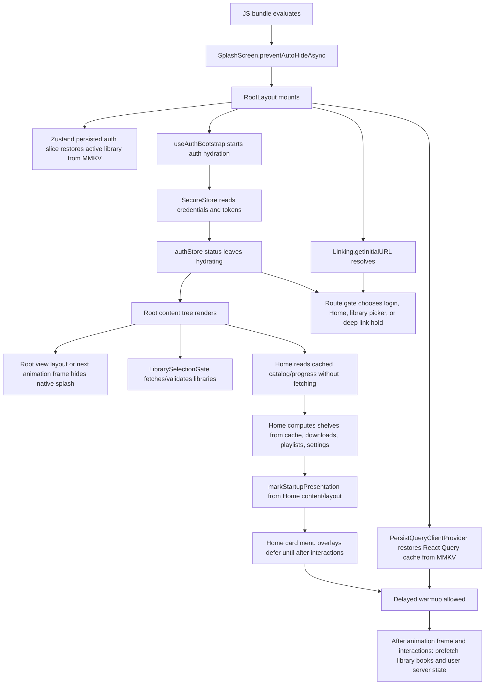

# Startup Task Map

This maps what the app currently does from process start through the first usable Home screen. It is based on the current Expo Router root layout, startup hooks, and development timing output.

## Critical Startup Path



## Startup Tasks By Blocking Level

### Native Splash / First Render Blockers

| Task | Where | What it does | Blocker risk |
| --- | --- | --- | --- |
| Auth hydration gate | `src/app/_layout.tsx`, `renderReady = status !== "hydrating"` | Root renders only a spinner until auth leaves `hydrating`. | High. Any slow SecureStore read keeps app behind the auth spinner and can delay splash hiding. |
| SecureStore credential and token reads | `src/auth/auth-store.ts`, `hydrateFromStorage`; `src/auth/auth-storage.ts` | Reads username/password/server URL and access/refresh tokens. | High. Five secure reads are required before the app knows its route. They are parallel within two groups, but still async native storage. |
| Initial URL resolution before route decisions | `src/app/_layout.tsx`, `Linking.getInitialURL` | Startup routing waits until `initialDeepLinkBookId !== undefined`. | Medium. Normal splash hiding does not wait for this, but route replacement does. A slow initial URL read can leave the user on an intermediate route before the final redirect. |
| React Query cache restore | `src/app/_layout.tsx`, `PersistQueryClientProvider`; `src/store/mmkv-query-persister.ts` | Restores persisted query snapshot from MMKV and parses JSON. | Medium. Current rendering does not explicitly wait on `queryRestoreReady`, but large synchronous JSON parse can still block the JS thread during provider restore. |

### First Useful Home Content

| Task | Where | What it does | Blocker risk |
| --- | --- | --- | --- |
| Home catalog/progress cache read | `src/hooks/use-home-shelves.ts` | Reads `libraryBooks` and `userServerState` from React Query cache without fetching. | Medium. This avoids network startup, but shelf computation cost scales with cached catalog/progress size. |
| Shelf derivation | `src/hooks/use-home-shelves.ts` | Builds continue listening, recently added, discover, downloaded, custom, and playlist shelves from cached inputs. Missing playlist shelves are filtered out of the assembled shelf model. | Medium. Several array maps/sorts/shuffles happen on render. Large libraries can make first Home render expensive. |
| Home card menu overlay mount | `src/components/Home/home-shelves-screen.tsx`, `src/components/Home/shelf-book-card.tsx` | Native card menu overlays are not rendered for the first Home Shelf Display; they mount after interactions. | Low for first display. This was moved off the critical path because each visible card menu previously derived shelf membership options during first render. |
| Library validation | `src/components/library-selection-gate.tsx` | Fetches libraries after authentication and validates active library. | Medium. It is not a splash blocker, but can push the library picker, clear invalid active library state, or trigger setup work immediately after first render. |
| Playlist fetch | `src/hooks/use-home-shelves.ts` | Fetches playlists when authenticated, online, and library context exists. | Low to medium. It runs on Home mount and updates shelf state, but the main catalog is not fetched here. |

### Deferred / Background Startup Work

| Task | Where | What it does | Blocker risk |
| --- | --- | --- | --- |
| Player service init | `src/app/_layout.tsx`; `src/player/player-service.ts` | Registers audio engine event handlers and clears active playback intent. | Low. No heavy async load in `init`. |
| Pending progress/bookmark/playlist sync | `src/auth/use-auth-bootstrap.ts` | Once authenticated and online, syncs pending local writes sequentially. | Medium. It should not block render, but can compete for network/JS after startup. It is currently sequential. |
| Session refresh | `src/auth/use-auth-bootstrap.ts`; `src/auth/auth-store.ts` | Refreshes token after hydration when online. Falls back to password login if refresh fails. | Medium. Not a render blocker, but can compete with library validation and warmups. |
| Post-first-content warmup | `src/app/_layout.tsx` | After first content, query restore, animation frame, and interactions, prefetches library books and user server state. | Low for splash, high for post-start network/CPU if cache is stale or large. |
| Sleep timer and ambient coordinators | `src/app/_layout.tsx`; coordinator files | Subscribe to playback/ambient stores and run only when relevant state exists. | Low. |

## Current Startup Gates

1. `status !== "hydrating"` gates the real app tree. This is the strictest startup gate.
2. `initialDeepLinkBookId !== undefined` gates route redirects, so routing waits for `Linking.getInitialURL`.
3. `queryRestoreReady` does not gate first render, but it gates warmup.
4. `hasPresentedInitialContent` gates warmup and is set by Home content/layout marking.
5. Native splash hides on root layout or the next animation frame after auth hydration, not after Home data is fully ready.

## Startup Timing Module

Development startup timing lives in `src/utils/dev-startup-tracing.ts`.

The compact summary is printed once per run when Home Shelf Display is recorded:

```text
[startup] Home Shelf Display in 1509ms | auth 53ms | secureStore 50ms/51ms | queryRestore 49ms (18KB, 5q) | initialUrl 40ms | homeHook 334ms | renderLayout 548ms | visible 0ms (12 books -> 31 visible)
```

Key APIs:

- `markStartup(name)` records a timestamp and returns it.
- `logStartupDuration(label, startedAtMs, payload)` records an async span.
- `measureStartupSync(label, task, getPayload)` records synchronous derivation cost.
- `recordHomeShelfDisplay(payload)` marks the first visible Home shelf surface and prints the compact summary.

Verbose per-mark logging is off by default. Enable it in development by setting `globalThis.__LAABS_STARTUP_TIMING_VERBOSE__ = true` before the marks you want to inspect.

## Blockers And Suspects

1. SecureStore is the first concrete blocker to measure. The app cannot leave `hydrating` until credential/token reads complete.
2. React Query restore may be a hidden JS-thread blocker because it synchronously `JSON.parse`s the whole persisted cache.
3. Home avoids network catalog fetch on first render, which is good, but it may pay a large CPU cost deriving shelves from restored data.
4. Library validation fetches immediately after auth. If the active library is invalid or missing, this can redirect/prompt during startup.
5. Pending sync work runs sequentially right after auth/online. It is background from a render perspective, but can add early network pressure.
6. Timing output is intentionally compact. The high-level Home Shelf Display summary should stay readable; noisy per-projection `measureStartupSync` calls are temporary while startup work is active.

## Recommended Measurement Points

Add visible development logging or profiler marks for:

1. JS start to `RootLayout` mount.
2. Auth hydrate start to complete.
3. SecureStore credentials read duration.
4. SecureStore tokens read duration.
5. Query restore start to success/error, including restored query count and serialized cache byte size.
6. `Linking.getInitialURL` duration.
7. First root layout and native splash hide.
8. Home first content/layout mark.
9. Home shelf computation duration and catalog size.
10. Library validation fetch duration.
11. Warmup start/complete and whether each prefetch actually fetched.

## First Optimization Targets

1. Keep startup trace output in development so the existing marks produce actionable timings.
2. Measure persisted React Query cache size before changing cache strategy.
3. If SecureStore is slow, consider persisting non-secret routing hints in MMKV so first route can render while secrets hydrate.
4. If Home shelf computation is slow, memoize or precompute shelf inputs by scope and avoid sorting/shuffling full catalogs during first render.
5. Move pending sync and library validation behind `InteractionManager.runAfterInteractions` if profiling shows they compete with first content.

## Cleanup Note

After the Home startup feature work is finished, trim the temporary fine-grained timing calls. Keep the compact, high-value startup timing marks for auth hydration, query restore, initial URL, Home hook/layout, and Home Shelf Display. Remove or gate the noisy per-projection `measureStartupSync` calls so development logs stay useful.
